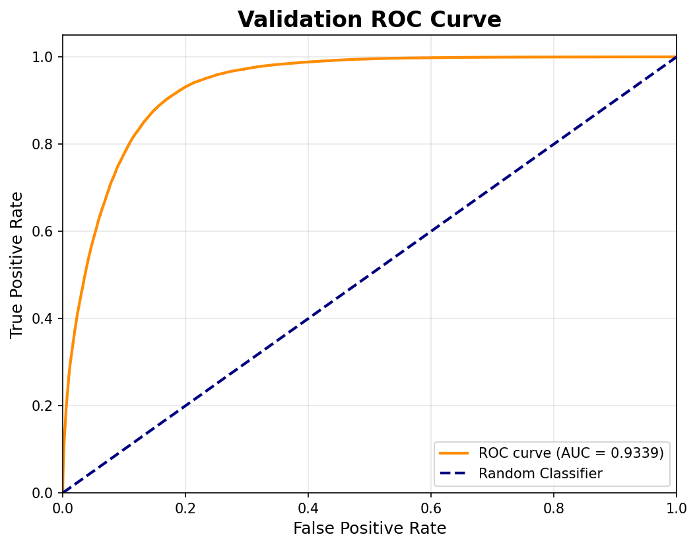

# Customer Churn Prediction - ML Pipeline

## 🎯 Tổng quan dự án

Dự án này xây dựng một pipeline ML hoàn chỉnh gồm 6 giai đoạn:

1. **Data Ingestion**: Thu thập và giải nén dữ liệu
2. **Data Validation**: Kiểm tra tính hợp lệ của dữ liệu
3. **Data Transformation**: Feature engineering, preprocessing, và SMOTE
4. **Model Training**: Huấn luyện và tối ưu hóa mô hình (LightGBM & XGBoost)
5. **Model Evaluation**: Đánh giá và tracking với MLflow
6. **Model Prediction / Inference**: Dự đoán dữ liệu mới (Test Set/Submission)

## 📁 Cấu trúc dự án

```
customer_churn_prediction/
├── config/                          # Các file cấu hình
│   ├── config.yaml                  # Cấu hình đường dẫn cho từng stage
│   ├── schema.yaml                  # Định nghĩa schema của dữ liệu
│   ├── logging.yaml                 # Cấu hình logging
│   └── params.yaml                  # Hyperparameters cho model training
│
├── src/                             # Source code chính
│   ├── components/                  # Các component xử lý logic
│   ├── config/                      # Configuration management
│   ├── entity/                      # Data entities (dataclasses)
│   ├── pipeline/                    # Pipeline wrappers cho từng stage
│   └── utils/                       # Utility functions
│
├── data/                            # Dữ liệu thô (zip files)
├── artifacts/                       # Outputs từ các stages
├── logs/                            # Log files
├── mlruns/                          # MLflow tracking data
├── EDA/                             # Exploratory Data Analysis notebooks
│
├── main.py                          # Entry point - chạy toàn bộ pipeline
├── requirements.txt                 # Python dependencies
└── README.md                        # Documentation (file này)
```

---

## 📂 Chi tiết các thư mục

### 1️⃣ `config/` - Thư mục cấu hình

```
config/
├── config.yaml          # Cấu hình đường dẫn artifacts cho từng stage
├── schema.yaml          # Schema validation cho dữ liệu
├── logging.yaml         # Cấu hình logging (format, handlers, levels)
└── params.yaml          # Hyperparameters cho GridSearchCV
```

#### 📄 Giải thích từng file:

- **`config.yaml`**:
  - Định nghĩa `artifacts_root` và đường dẫn cho từng stage
  - Cấu hình MLflow URI cho tracking
  - Ví dụ: `data_ingestion.root_dir`, `model_trainer.train_data_path`

- **`schema.yaml`**:
  - Định nghĩa kiểu dữ liệu cho từng cột (int64, float64, object)
  - Chỉ định cột target (`Churn`)
  - Dùng để validate dữ liệu trong Stage 2

- **`logging.yaml`**:
  - Cấu hình format log (timestamp, level, message)
  - Định nghĩa handlers (console, file)
  - Thiết lập log levels cho từng module

- **`params.yaml`**:
  - Hyperparameters cho LightGBM: `n_estimators`, `max_depth`, `learning_rate`
  - Hyperparameters cho XGBoost: `n_estimators`, `max_depth`, `learning_rate`
  - Mỗi mô hình có 6 tổ hợp tham số cho GridSearchCV

---

### 2️⃣ `src/components/` - Components xử lý logic

```
src/components/
├── data_ingestion.py           # Giải nén dữ liệu từ zip
├── data_validation.py          # Kiểm tra schema của dữ liệu
├── data_transformation.py      # Feature engineering & preprocessing
├── model_trainer.py            # Training với GridSearchCV
├── model_evaluation.py         # Evaluation và visualization
└── prediction.py               # Dự đoán dữ liệu mới (Inference)
```

#### 📄 Giải thích từng file:

- **`data_ingestion.py`** (Stage 1):
  - **Class**: `DataIngestion`
  - **Chức năng**: Giải nén file `playground-series-s6e3.zip` từ thư mục `data/`
  - **Output**: `train.csv`, `test.csv` trong `artifacts/data_ingestion/`
  - **Method chính**: `extract_zip_file()`

- **`data_validation.py`** (Stage 2):
  - **Class**: `DataValidation`
  - **Chức năng**: Kiểm tra xem tất cả các cột trong dữ liệu có khớp với `schema.yaml` không
  - **Output**: `status.txt` (True/False) trong `artifacts/data_validation/`
  - **Method chính**: `validate_all_columns()`

- **`data_transformation.py`** (Stage 3):
  - **Class**: `DataTransformation`, `ChurnFeatureEngineer`, `WinsorizerTransformer`
  - **Chức năng**:
    - Tạo 9 features mới từ EDA insights
    - Preprocessing: Imputation, Scaling, Encoding
    - Áp dụng SMOTE để cân bằng nhãn (50:50)
  - **Output**:
    - `train_transformed.npz` (920,754 samples, 23 features)
    - `test_transformed.npz` (254,655 samples, 23 features)
    - `preprocessor.joblib` (sklearn pipeline đã fit)
  - **Method chính**: `initiate_data_transformation()`

- **`model_trainer.py`** (Stage 4):
  - **Class**: `ModelTrainer`
  - **Chức năng**:
    - Load dữ liệu từ `.npz` files
    - Chia train/validation (80/20)
    - GridSearchCV cho LightGBM (6 tổ hợp)
    - GridSearchCV cho XGBoost (6 tổ hợp)
    - So sánh và chọn mô hình tốt nhất dựa trên ROC AUC
    - Log tất cả vào MLflow
  - **Output**:
    - `model.joblib` (mô hình tốt nhất)
    - `metrics.json` (accuracy, precision, recall, f1, roc_auc)
  - **Method chính**: `initiate_model_trainer()`

- **`model_evaluation.py`** (Stage 5):
  - **Class**: `ModelEvaluation`
  - **Chức năng**:
    - Load mô hình đã train
    - Tạo predictions trên test set
    - Tính toán metrics (nếu có nhãn)
    - Tạo visualizations: Confusion Matrix, ROC Curve
    - Log artifacts vào MLflow
  - **Output**:
    - `predictions.npz` (predictions cho test set)
    - `metrics.json` (nếu có nhãn test)
    - `confusion_matrix.png`, `roc_curve.png` (nếu có nhãn test)
  - **Method chính**: `initiate_model_evaluation()`

- **`prediction.py`** (Stage 6):
  - **Class**: `PredictionPipeline`
  - **Chức năng**:
    - Load mô hình tốt nhất đã train và pipeline preprocessor
    - Load dữ liệu test chưa gán nhãn
    - Thực hiện tiền xử lý và dự đoán xác suất rời bỏ (Churn probabilities)
    - Tạo file output phục vụ submission
  - **Output**: `submission.csv`
  - **Method chính**: `predict()`

---

### 3️⃣ `src/config/` - Configuration Management

```
src/config/
├── __init__.py
└── configuration.py        # ConfigurationManager class
```

#### 📄 Giải thích:

- **`configuration.py`**:
  - **Class**: `ConfigurationManager`
  - **Chức năng**:
    - Đọc các file YAML (`config.yaml`, `schema.yaml`, `params.yaml`)
    - Tạo thư mục artifacts nếu chưa tồn tại
    - Cung cấp methods để lấy config cho từng stage
  - **Methods**:
    - `get_data_ingestion_config()` → `DataIngestionConfig`
    - `get_data_validation_config()` → `DataValidationConfig`
    - `get_data_transformation_config()` → `DataTransformationConfig`
    - `get_model_trainer_config()` → `ModelTrainerConfig`
    - `get_model_evaluation_config()` → `ModelEvaluationConfig`
    - `get_prediction_config()` → `PredictionConfig`

---

### 4️⃣ `src/entity/` - Data Entities

```
src/entity/
└── config_entity.py        # Dataclasses cho config objects
```

#### 📄 Giải thích:

- **`config_entity.py`**:
  - **Dataclasses** (frozen=True để immutable):
    - `DataIngestionConfig`: root_dir, local_data_file, unzip_dir
    - `DataValidationConfig`: root_dir, STATUS_FILE, unzip_data_dir, all_schema
    - `DataTransformationConfig`: root_dir, train_data_path, test_data_path, preprocessor_path
    - `ModelTrainerConfig`: root_dir, train_data_path, test_data_path, model_name, lgbm_params, xgboost_params, mlflow_uri
    - `ModelEvaluationConfig`: root_dir, test_data_path, model_path, all_params, metric_file_name, mlflow_uri
    - `PredictionConfig`: model_path, preprocessor_path, test_data_path, submission_output_path
  - **Mục đích**: Type-safe configuration objects, dễ dàng truyền giữa các components

---

### 5️⃣ `src/pipeline/` - Pipeline Wrappers

```
src/pipeline/
├── __init__.py
├── stage_01_data_ingestion.py          # Wrapper cho Stage 1
├── stage_02_data_validation.py         # Wrapper cho Stage 2
├── stage_03_data_transformation.py     # Wrapper cho Stage 3
├── stage_04_model_trainer.py           # Wrapper cho Stage 4
├── stage_05_model_evaluation.py        # Wrapper cho Stage 5
└── stage_06_prediction.py              # Wrapper cho Stage 6
```

#### 📄 Giải thích từng file:

Mỗi file pipeline có cấu trúc tương tự:

- **Class**: `<StageName>TrainingPipeline`
- **Method**: `main()`
  1. Khởi tạo `ConfigurationManager`
  2. Lấy config cho stage tương ứng
  3. Khởi tạo component với config
  4. Gọi method chính của component

**Ví dụ**: `stage_04_model_trainer.py`

```python
class ModelTrainerTrainingPipeline:
    def main(self):
        config = ConfigurationManager()
        model_trainer_config = config.get_model_trainer_config()
        model_trainer = ModelTrainer(config=model_trainer_config)
        model_trainer.initiate_model_trainer()
```

**Mục đích**:

- Tách biệt logic component và orchestration
- Dễ dàng chạy từng stage độc lập để debug
- Có thể chạy: `python src/pipeline/stage_04_model_trainer.py`

---

### 6️⃣ `src/utils/` - Utility Functions

```
src/utils/
├── common.py           # Các hàm tiện ích chung
└── logger.py           # Logger configuration
```

#### 📄 Giải thích:

- **`common.py`**:
  - `read_yaml()`: Đọc file YAML và trả về ConfigBox
  - `create_directories()`: Tạo danh sách thư mục
  - `save_json()`, `load_json()`: Lưu/đọc JSON
  - `save_bin()`, `load_bin()`: Lưu/đọc binary files (joblib)
  - `get_size()`: Lấy kích thước file

- **`logger.py`**:
  - Setup logging từ `config/logging.yaml`
  - Tạo logger instance dùng chung: `logger`
  - Tự động tạo thư mục `logs/` nếu chưa có
  - Cấu hình UTF-8 encoding cho Windows

---

## 🚀 Hướng dẫn sử dụng

### 1. Cài đặt môi trường

```bash
# Clone repository
git clone <repository-url>
cd customer_churn_prediction

# Tạo virtual environment
python -m venv venv

# Activate virtual environment
# Windows:
venv\Scripts\activate
# Linux/Mac:
source venv/bin/activate

# Cài đặt dependencies
pip install -r requirements.txt
```

### 2. Chuẩn bị dữ liệu

Đặt file `playground-series-s6e3.zip` vào thư mục `data/`:

```
data/
└── playground-series-s6e3.zip
```

### 3. Chạy toàn bộ pipeline

```bash
python main.py
```

**Thời gian ước tính**: 15-20 phút

- Stage 1-3: ~30 giây
- Stage 4 (Training): ~10-15 phút (GridSearchCV)
- Stage 5 (Evaluation): ~10 giây
- Stage 6 (Prediction & Submission): ~15 giây

### 4. Xem kết quả trong MLflow

```bash
mlflow ui
```

Truy cập: http://localhost:5000

Trong MLflow UI bạn sẽ thấy:

- **Experiments**: Các lần chạy training
- **Runs**: LightGBM_Training, XGBoost_Training, Model_Evaluation
- **Metrics**: ROC AUC, F1-Score, Accuracy, Precision, Recall
- **Parameters**: Hyperparameters của từng mô hình
- **Artifacts**: Models, Confusion Matrix, ROC Curve

### 5. Chạy từng stage riêng lẻ (để debug)

```bash
# Stage 1: Data Ingestion
python src/pipeline/stage_01_data_ingestion.py

# Stage 2: Data Validation
python src/pipeline/stage_02_data_validation.py

# Stage 3: Data Transformation
python src/pipeline/stage_03_data_transformation.py

# Stage 4: Model Training
python src/pipeline/stage_04_model_trainer.py

# Stage 5: Model Evaluation
python src/pipeline/stage_05_model_evaluation.py

# Stage 6: Prediction & Submission
python src/pipeline/stage_06_prediction.py

# Hoặc có thể chạy nhanh script prediction độc lập:
python predict.py
```

---

## 📊 Kết quả chi tiết

### Model Performance

| Mô hình      | ROC AUC    | F1-Score | Kết quả         |
| ------------ | ---------- | -------- | --------------- |
| **LightGBM** | **93.39%** | -        | ✅ **Tốt nhất** |
| XGBoost      | 93.01%     | 86.63%   | -               |

## 📊 Kết quả đạt được

- **Mô hình tốt nhất**: LightGBM
- **ROC AUC Score**: 93.39%
- **Dataset**: Kaggle Playground Series S6E3 (~594k training samples)
- **Features**: 23 features sau feature engineering và preprocessing

### 📈 Biểu đồ đánh giá (Validation Set)

Để trực quan hóa hiệu suất phân loại của mô hình tốt nhất (LightGBM), các biểu đồ đánh giá đã được vẽ và lưu trữ trong thư mục `docs/`:

#### 1. Confusion Matrix (Ma trận nhầm lẫn)


#### 2. ROC Curve (Đường cong ROC)



### Artifacts được tạo ra

```
artifacts/
├── data_ingestion/
│   ├── train.csv                       # 594,194 rows
│   └── test.csv                        # 254,655 rows
│
├── data_validation/
│   └── status.txt                      # Validation status: True
│
├── data_transformation/
│   ├── train_transformed.npz           # 920,754 rows, 23 features (sau SMOTE)
│   ├── test_transformed.npz            # 254,655 rows, 23 features
│   └── preprocessor.joblib             # Sklearn pipeline đã fit
│
├── model_trainer/
│   ├── model.joblib                    # LightGBM model (tốt nhất)
│   └── metrics.json                    # ROC AUC: 0.9339
│
├── model_evaluation/
│   └── predictions.npz                 # Predictions cho test set
│
└── prediction/                         # Thư mục artifacts dự đoán (Stage 6)
```

Và ở thư mục gốc:

- `submission.csv` # File nộp bài Kaggle cuối cùng (chứa id, Churn)

````

---

## 🔧 Cấu hình nâng cao

### Thay đổi Hyperparameters

Chỉnh sửa `params.yaml`:

```yaml
LightGBM:
  n_estimators: [100, 200, 300] # Thêm giá trị mới
  max_depth: [3, 5, 7, 10] # Thêm giá trị mới
  learning_rate: [0.01, 0.1] # Thêm learning rate khác
````

### Thay đổi đường dẫn artifacts

Chỉnh sửa `config/config.yaml`:

```yaml
artifacts_root: my_custom_artifacts # Thay đổi thư mục gốc

model_trainer:
  root_dir: my_custom_artifacts/models
  model_name: my_model.joblib
```

### Cấu hình MLflow Tracking Server

Chỉnh sửa `config/config.yaml`:

```yaml
model_trainer:
  mlflow_uri: "http://your-mlflow-server:5000"

model_evaluation:
  mlflow_uri: "http://your-mlflow-server:5000"
```

